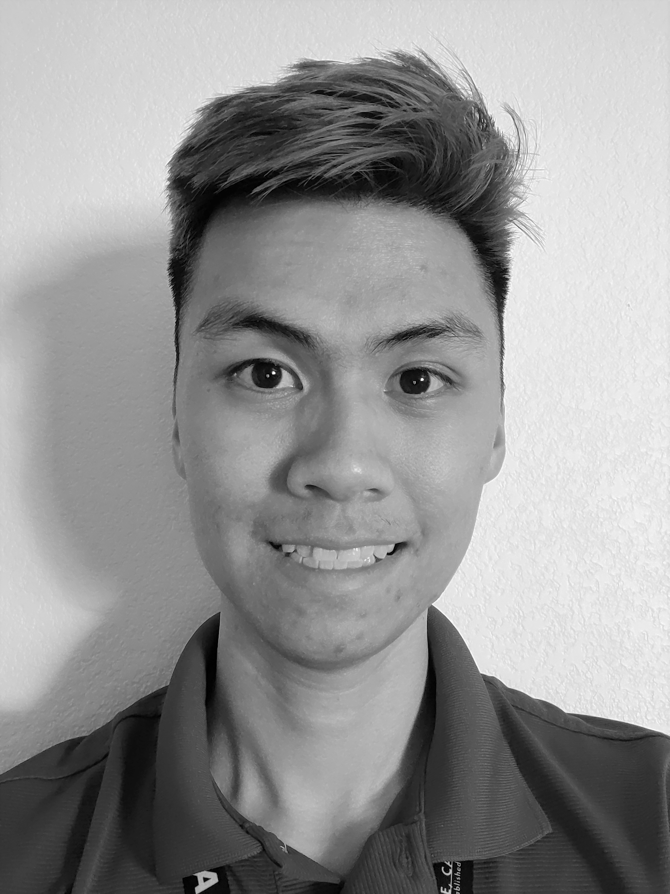

Hello! My name is Alex Yu. I am currently an undergraduate Computer Engineering student at UC Davis. I was born and raised in Sacramento. Out of high school, I wanted to do my part for my country so I enlisted with the U.S. Army Reserve as a Cargo Specialist. Returning from training, I enrolled in community college where I started pursuing my love for computers and tech. A dream of mine has always been to help create computer processors. Recently, I have taken an interest in computer vision and machine learning. 
