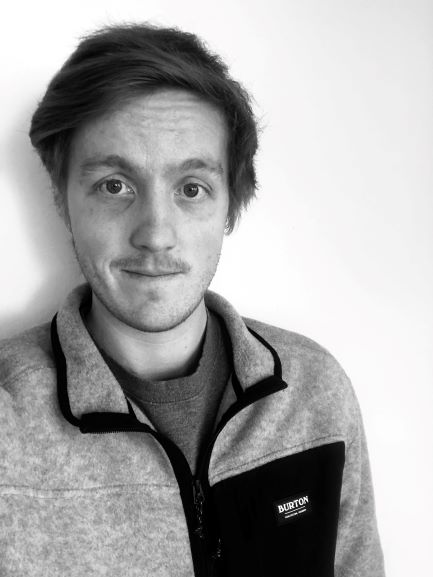

Hello, my name is Liam Moore and I am currently an undergraduate at UC Davis pursuing my BS in Electrical Engineering. My area of interest is RF and microwave engineering more specifically, the theory, techniques, and applications of guided wave and wireless technologies. After graduating from UC Davis my plan is to continue my education in pursuit of a Master's degree. Upon finishing my formal education, I intend to move back to Germany where I can hopefully find work in the aerospace industry. 
