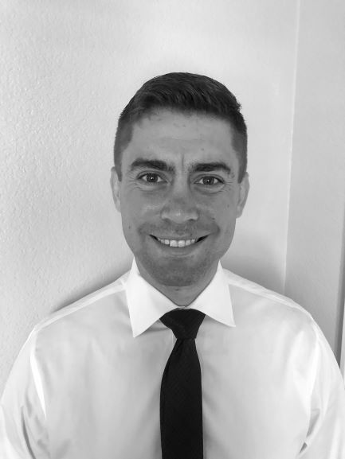

My name is Nick Newcomb and I am pursuing a joint BS/MS degree in electrical engineering at UC Davis. I am a first-generation college student and decided to pursue my education after serving in the United States Navy for 8 years. While in the Navy I served as a nuclear operations instructor at a prototype reactor as well as a propulsion plant supervisor aboard the USS Carl Vinson. As a Navy veteran and former nuclear reactor operator I maintain core values of integrity, ownership and commitment to excellence. I aspire to find a career that combines these core values with my education in electrical engineering to continue serving my country and feel a sense of purpose. My research interests include RF engineering and photonics, and I am currently working on designing diagnostic equipment that will aid in measuring magnetic fields generated in pulsed power systems. 

 
