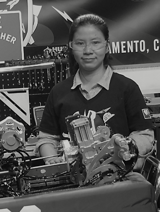

My name is Uyen Do-Tran. I am a 4th year Electrical Engineering Major at UC Davis.  
In 2012, I came to America with my family. I have been in FIRST robotics program for almost 8 years. While in high school, during a six-week period I worked with my teammates to build robots capable of competing that weight up to 125 pounds to enter the year's game. Currently, I am the lead electrical mentor of the team 3598 in FIRST Robotics. In the program, my main roles are training high school students with electronic devices, basic electrical tools, set up pneumatic system, and design components on CREO. During summer, I volunteer to introducing STEAM through robotics workshops for kids at the Sacramento Libraries. My team has won the Engineering Inspiration Award, Quality Award, Safety Award, and  Regional Winner of the Canadian Competition those allowed us to be sponsored by NASA to enter the World Championship hosted at Houston, Texas in 2019, and 2020.    

 

 
