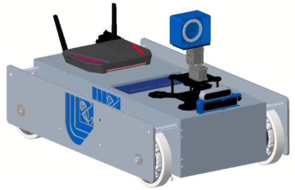
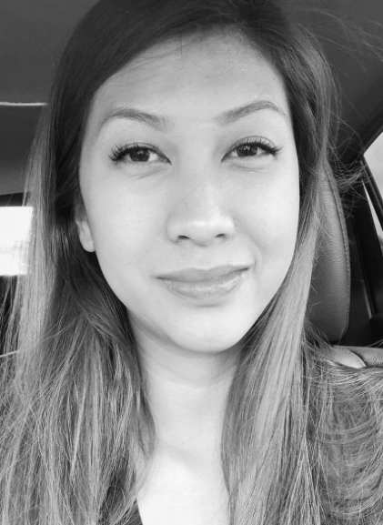
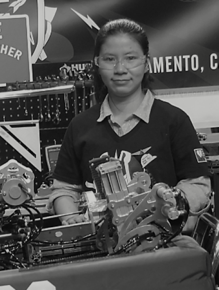
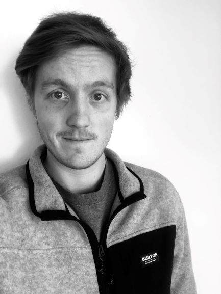
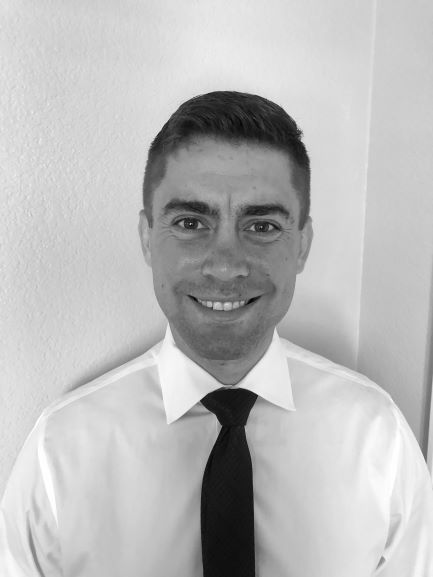

___

<H2> Team </H2>

|**Hawkeye I** |  |
|:---------------------------------------------------------:|:---------------------------------------------------:|
|**Jen Dacanay**   **Electrical/Programming**   Joint B.S./M.S. Electrical Engineering   June 2021/June 2022   Focus: Digital Signal Processing/Circuits   [Bio/Interests](Jen.md)   |  |
|**Uyen Do-Tran**   **Electrical/Programming**   B.S. Electrical Engineering   June 2021   Focus: Digital Comm./Robotics/DSP   [Bio/Interests](Uyen.md)  |  | 
|**Liam Moore**   **Electrical/Programming**   B.S. Electrical Engineering   June 2021  Focus: RF Engineering/Telecommunications   [Bio/Interests](Liam.md)  |  | 
|**Nick Newcomb**   **Electrical/Programming**   B.S./M.S. Electrical Engineering   June 2021/June 2022   Focus: DSP Engineer/Machine Learning   [Bio/Interests](Nick.md)  |  | 
|**Alex Yu**   **Electrical/Programming**   B.S. Computer Engineering   June 2021   Focus: Computer Architecture/Machine Learning   [Bio/Interests](Alex.md)  |   |

<!--  Revision 2

<TABLE>
   <TR>
    <TD align="center">   </TD>
    <TD align="center">  </TD>
  </TR>
  <TR>
   <TD align="center"> <b> Jen Dacanay   Electrical/Programming   </b>   Joint B.S./M.S. Electrical Engineering June 2021/June 2022   Focus: Digital Signal Processing/Circuits   </b> [Bio/Interests](Jen.md)  </TD>
     <TD align="center"> <b> Uyen Do-Tran   Electrical/Programming  </b>   B.S. Electrical Engineering June 2021   Focus: Digital Comm./Robotics/DSP   [Bio/Interests](Uyen.md) <br/ </TD>
  </TR>
  <TR>
    <TD align="center">   </TD>
    <TD align="center">  </TD>
  </TR>
  <TR>
     <TD align="center"> <b> Liam Moore   Electrical/Programming </b>    B.S. Electrical Engineering June 2021  Focus: RF Engineering/Telecommunications   [Bio/Interests](Liam.md)   </TD>
     <TD align="center"> <b> Hawkeye I   Inspections/Safety  </b>   Capacitor Bay   Focus: Bank Modules   [Bio/Interests]   </TD>
  </TR>
  <TR>
    <TD align="center">  </TD>
    <TD align="center">  </TD>
  </TR>
  <TR>
    <TD align="center"> <b> Nick Newcomb   Electrical/Programming </b>   B.S./M.S. Electrical Engineering June 2021/June 2022   Focus: DSP Engineer/Machine Learning   [Bio/Interests](Nick.md)   </TD>
     <TD align="center"> <b> Alex Yu   Electrical/Programming  </b>   B.S. Computer Engineering June 2021  Focus: Computer Architecture/Machine Learning   [Bio/Interests](Alex.md)   </TD>
  </TR>
  </TABLE>
  

  

-->

  <!--  
|**Jen Dacanay**   **Electrical/Programming**   B.S./M.S. Electrical Engineering June 2021/June 2022   Focus: Digital Signal Processing/Circuits   [Bio/Interests](Jen.md)  | |
|:---------------------------------------------------------:|:---------------------------------------------------:|
|**Uyen Do-Tran**   **Electrical/Programming**   B.S. Electrical Engineering June 2021   Focus: Digital Comm./Robotics/DSP   [Bio/Interests](Uyen.md)  || 
|**Liam Moore**   **Electrical/Programming**   B.S. Electrical Engineering June 2021  Focus: RF Engineering/Telecommunications   [Bio/Interests](Liam.md)  |  | 
|**Nick Newcomb**   **Electrical/Programming**   B.S./M.S. Electrical Engineering June 2021/June 2022   Focus: DSP Engineer/Machine Learning   [Bio/Interests](Nick.md)  |  | 
|**Alex Yu**   **Electrical/Programming**   B.S. Computer Engineering June 2021  Focus: Computer Architecture/Machine Learning   [Bio/Interests](Alex.md)  | |
-->
