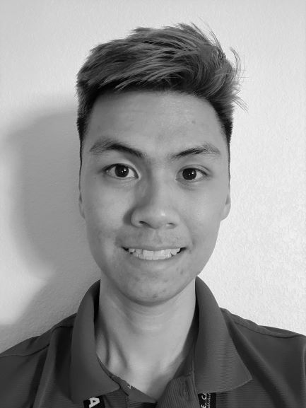

___
## Team

[Jen Dacanay](Jen.md) 

Currently a senior at UC Davis, where I am pursuing a joint BS/MS in Electrical Engineering.  
Born and raised in Guam, I studied business administration with a concentration in Finance and Economics at the University of Guam. I worked for several years as an accountant at Louis Vuitton and later as a loan operations specialist at Citibank. I moved to San Francisco, California with plans to attend graduate school. While working in an electronic manufacturing and software start up as the Operations Manager, I was drawn towards the process of creating electronic hardware when I assisted our product development engineer who built a controller in-house for our LED billboards. I thus shifted focus and attended Diablo Valley College and subsequently UC Davis. 

[Uyen Do-Tran](Uyen.md) 

My name is Uyen Do-Tran. I am a 4th year Electrical Engineering Major at UC Davis.  
In 2012, I came to America with my family. I have been in FIRST robotics program for almost 8 years. While in high school, during a six-week period I worked with my teammates to build robots capable of competing that weight up to 125 pounds to enter the year's game. Currently, I am the lead electrical mentor of the team 3598 in FIRST Robotics. In the program, my main roles are training high school students with electronic devices, basic electrical tools, set up pneumatic system, and design components on CREO. During summer, I volunteer to introducing STEAM through robotics workshops for kids at the Sacramento Libraries. My team has won the Engineering Inspiration Award, Quality Award, Safety Award, and  Regional Winner of the Canadian Competition those allowed us to be sponsored by NASA to enter the World Championship hosted at Houston, Texas in 2019, and 2020.  

[Liam Moore](Liam.md) 

 
Hello, my name is Liam Moore and I am currently an undergraduate at UC Davis pursuing my BS in Electrical Engineering. My area of interest is RF and microwave engineering more specifically, the theory, techniques, and applications of guided wave and wireless technologies. After graduating from UC Davis my plan is to continue my education in pursuit of a Master's degree. Upon finishing my formal education, I intend to move back to Germany where I can hopefully find work in the aerospace industry. 

[Nick Newcomb](Nick.md) 

My name is Nick Newcomb and I am pursuing a joint BS/MS degree in electrical engineering at UC Davis. I am a first-generation college student and decided to pursue my education after serving in the United States Navy for 8 years. While in the Navy I served as a nuclear operations instructor at a prototype reactor as well as a propulsion plant supervisor aboard the USS Carl Vinson. As a Navy veteran and former nuclear reactor operator I maintain core values of integrity, ownership and commitment to excellence. I aspire to find a career that combines these core values with my education in electrical engineering to continue serving my country and feel a sense of purpose. My research interests include RF engineering and photonics, and I am currently working on designing diagnostic equipment that will aid in measuring magnetic fields generated in pulsed power systems. 

Hello! My name is Alex Yu. I am currently an undergraduate Computer Engineering student at UC Davis. I was born and raised in Sacramento. Out of high school, I wanted to do my part for my country so I enlisted with the U.S. Army Reserve as a Cargo Specialist. Returning from training, I enrolled in community college where I started pursuing my love for computers and tech. A dream of mine has always been to help create computer processors. Recently, I have taken an interest in computer vision and machine learning. 

| | |
|:---------------------------------------------------------:|:---------------------------------------------------:|
|**Nick Newcomb**   **Electrical/Programming**   B.S./M.S. Electrical Engineering June 2021/June 2022   Focus: DSP Engineer/Machine Learning   |  |
|**Alex Yu**   **Electrical/Programming**   B.S. Computer Engineering June 2021  Focus: Compouter Architecture/Machine Learning   |  |
