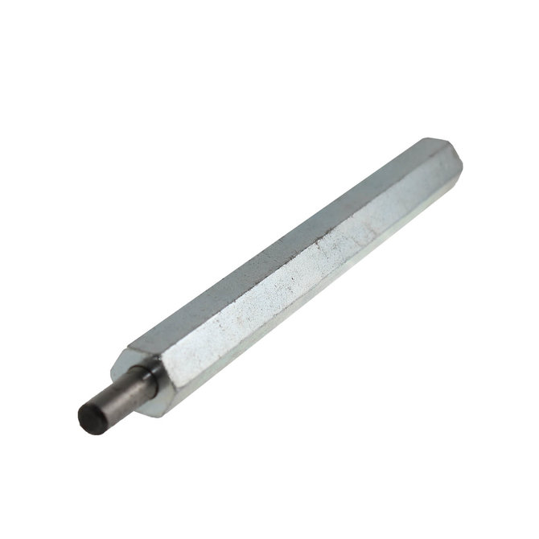
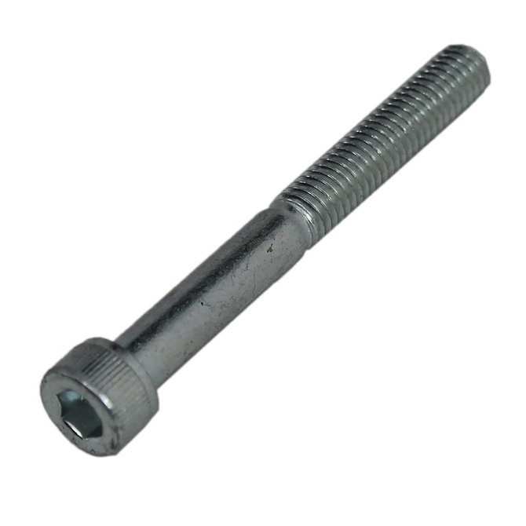
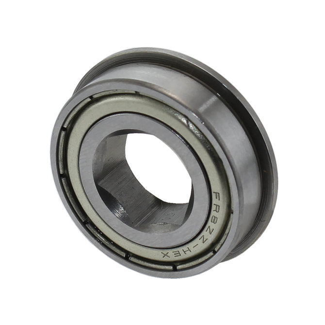

___

<H1>Componenents</H1>

<H2><b>Structural</b></H2>

  

|   Name  |  Description   | Cost | Weight|  Power  |
|:-------:|:--------------:|:----:|:-----:|:-------:|
|Spark Max|Motor Controller|166.39|0.5 lbs|2.4 watts|

  

|   Name  |  Description   | Cost | Weight|  Power  |
|:-------:|:--------------:|:----:|:-----:|:-------:|
|   NEO   |Brushless Motor |93.07 |1.9 lbs|Variable |

  

|   Name  |  Description   | Cost  | Weight|  Power  |
|:-------:|:--------------:|:-----:|:-----:|:-------:|
|CIM Sport|    Gear Box    |192.00 |3.14lbs|         |

  

|   Name  |  Description   | Cost  | Weight|  Power  |
|:-------:|:--------------:|:-----:|:-----:|:-------:|
|Hex Shaft|    Extension   | 40.00 |       |         |

  

|   Name  |  Description   | Cost  | Weight|  Power  |
|:-------:|:--------------:|:-----:|:-----:|:-------:|
|Hex Screw|      Screw     | 0.27  |       |         |

  

|   Name  |  Description   | Cost  | Weight|  Power  |
|:-------:|:--------------:|:-----:|:-----:|:-------:|
| Bearing |   Hex Bearing  | 24.00 |       |         |

  

|   Name  |  Description   | Cost  | Weight|  Power  |
|:-------:|:--------------:|:-----:|:-----:|:--------:|
|Phantom X|  Camera Mount  |222.33 |  0.5  |6.24 watts|

<H2><b>Power/Battery</b></H2>
