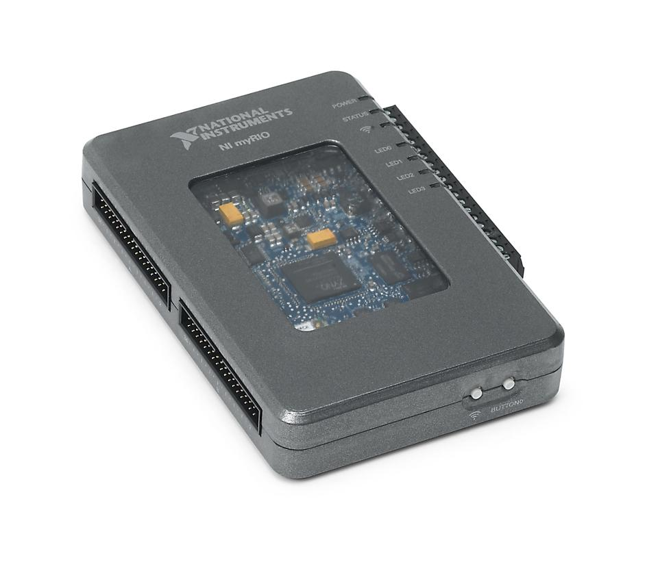
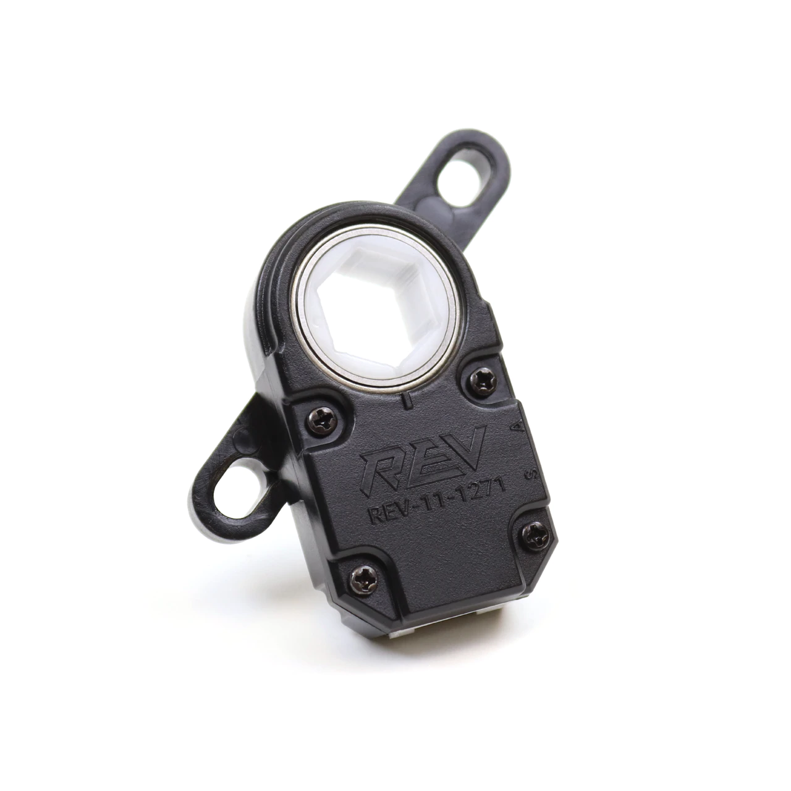
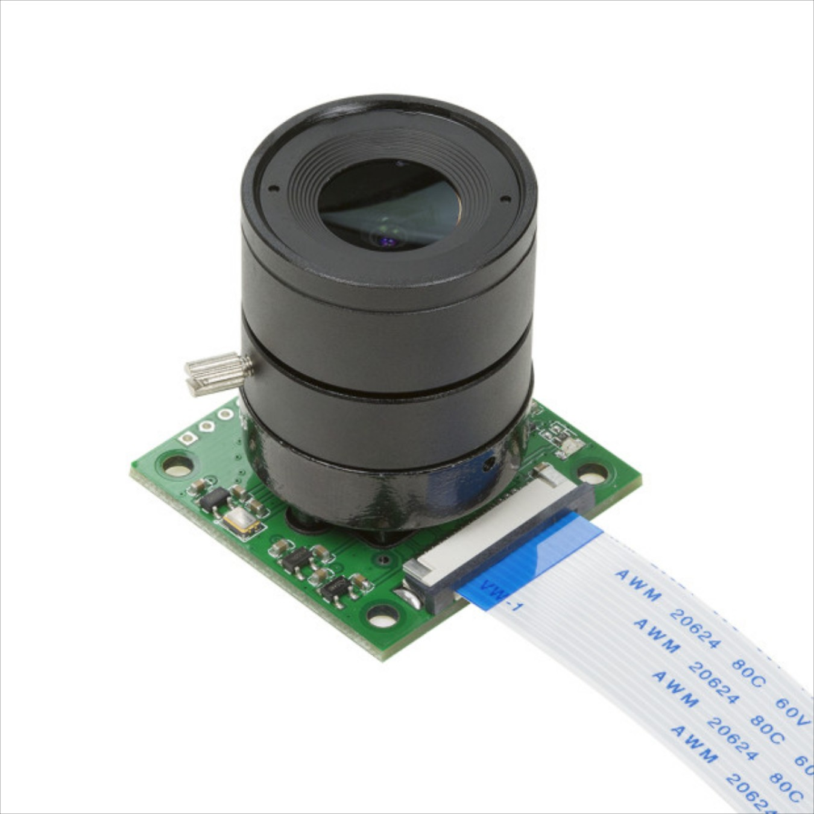

<H1>Components</H1>

  
Components List

  <ul>
    <li> Structural</li>
    <ul>
 <li><a href="https://mesmerizing-engineers.github.io/MESMerizing-Engineers/docs/components#MC">Motor Controller</a></li>
 <li><a href="https://mesmerizing-engineers.github.io/MESMerizing-Engineers/docs/components#Brushless-Motor">Brushless Motor Controller</a></li>
 <li><a href="https://mesmerizing-engineers.github.io/MESMerizing-Engineers/docs/components#Gearbox">Gearbox</a></li>
 <li><a href="https://mesmerizing-engineers.github.io/MESMerizing-Engineers/docs/components#Camera-Mount">Camera Mount</a></li>
    </ul>
    <li> Power </li>
    <ul>
    <!-- Put Power Components Here -->
 <li><a href="https://mesmerizing-engineers.github.io/MESMerizing-Engineers/docs/components#bms">Battery Managment System</a></li>
 <li><a href="https://mesmerizing-engineers.github.io/MESMerizing-Engineers/docs/components#vrm">Voltage Regulator Module</a></li>
    </ul>
    <li> Control </li>
    <ul>
    <!-- Put Control Components Here -->
 <li><a href="https://mesmerizing-engineers.github.io/MESMerizing-Engineers/docs/components#myRIO">Central Hardware Computer</a></li>
 <li><a href="https://mesmerizing-engineers.github.io/MESMerizing-Engineers/docs/components#Jetson">On board Computer</a></li>
 <li><a href="https://mesmerizing-engineers.github.io/MESMerizing-Engineers/docs/components#router">Router</a></li>
    </ul>
    <li> Sensors </li>
    <ul>
      <!-- Put Sensor Components Here -->
 <li><a href="https://mesmerizing-engineers.github.io/MESMerizing-Engineers/docs/components#Depth-Camera">Depth Camera</a></li>
  <li><a href="https://mesmerizing-engineers.github.io/MESMerizing-Engineers/docs/components#Tracking-Camera">Tracking Camera</a></li>
 <li><a href="https://mesmerizing-engineers.github.io/MESMerizing-Engineers/docs/components#Encoder">Encoder</a></li>
 <li><a href="https://mesmerizing-engineers.github.io/MESMerizing-Engineers/docs/components#Arducam">Inspection Camera</a></li>
    </ul>
  </ul>

<H2><b>Structural</b></H2>

  

  

|   Name  |  Description   | Cost | Weight|  Power  |
|:-------:|:--------------:|:----:|:-----:|:-------:|
|Spark Max|Motor Controller|166.39|0.5 lbs|2.4 watts|

  

|   Name  |  Description   | Cost | Weight|  Power  |
|:-------:|:--------------:|:----:|:-----:|:-------:|
|   NEO   |Brushless Motor |93.07 |1.9 lbs|Variable |

  

|   Name  |  Description   | Cost  | Weight|  Power  |
|:-------:|:--------------:|:-----:|:-----:|:-------:|
|CIM Sport|    Gear Box    |192.00 |3.14lbs|         |

<H2><b>Controls</b></H2>

  
 

|   Name  |  Description   | Cost  | Weight|  Power  |
|:-------:|:--------------:|:-----:|:-----:|:-------:|
|NI myRIO |Controller      |1087.00|0.73lbs|1.2 watts|

  

|   Name  |  Description   | Cost  | Weight|  Power  |
|:-------:|:--------------:|:-----:|:-----:|:-------:|
|NVIDIA Jetson Xavier NX|On board computer|398.99|1.75lbs|10 watts |

  

|   Name  |  Description   | Cost  | Weight|  Power  |
|:-------:|:--------------:|:-----:|:-----:|:-------:|
|TP-Link AC4000|Router     |178.99 |3.59 lbs|        |

<H2><b>Camera/Sensors</b></H2>

  

|   Name  |  Description   | Cost  | Weight|  Power   |
|:-------:|:--------------:|:-----:|:-----:|:--------:|
|Intel D435i|  Depth Camera  |199.00 | 0.159 |3.5 watts |

  

|   Name  |  Description   | Cost  | Weight|  Power   |
|:-------:|:--------------:|:-----:|:-----:|:--------:|
|Intel RealSense T265|  Tracking Camera  |199.00 | 0.0485 |1.5 watts |

  

<TABLE>
   <TR>
    <TD><b>Name</b></TD>
     <TD><b>Desciption</b></TD>
     <TD><b>Cost</b></TD> 
     <TD><b>Weight[lbs]</b></TD>
     <TD><b>Power[W]</b></TD>
  </TR>
  <TR>
    <TD>REV</TD>
    <TD>Motor Encoder</TD>
    <TD>35.00</TD> 
    <TD>0.205</TD>
    <TD>0.1</TD>
  </TR>
  </TABLE>
  

  <!--
|   Name  |  Description   | Cost  | Weight|  Power   |
|:-------:|:--------------:|:-----:|:-----:|:--------:|
|   REV   |  Motor Encoder | 35.00 | 0.205 |0.1 watts |
-->

  

<TABLE>
   <TR>
    <TD><b>Name</b></TD>
     <TD><b>Desciption</b></TD>
     <TD><b>Cost</b></TD> 
     <TD><b>Weight[lbs]</b></TD>
     <TD><b>Power[W]</b></TD>
  </TR>
  <TR>
    <TD>Sony Arducam</TD>
    <TD>Inspection Camera</TD>
    <TD>92.99</TD> 
    <TD>0.3</TD>
    <TD>0.48</TD>
  </TR>
  </TABLE>
  

<!--
|   Name  |  Description   | Cost  | Weight|  Power   |
|:-------:|:--------------:|:-----:|:-----:|:--------:|
|Sony Arducam|  Inspection Camera | 92.99 | 0.3 |0.48 watts|
-->

  

<TABLE>
   <TR>
    <TD><b>Name</b></TD>
     <TD><b>Desciption</b></TD>
     <TD><b>Cost</b></TD> 
     <TD><b>Weight[lbs]</b></TD>
     <TD><b>Power[W}</b></TD>
  </TR>
  <TR>
    <TD>Phantom X</TD>
    <TD>Camera Mount</TD>
    <TD>222.33</TD> 
    <TD>
</TD>
    <TD>6.24</TD>
  </TR>
  </TABLE>
  

<!--
|   Name  |  Description   | Cost  | Weight|  Power  |
|:-------:|:--------------:|:-----:|:-----:|:--------:|
|Phantom X|  Camera Mount  |222.33 |  0.5  |6.24 watts|
-->

<H2><b>Power/Battery</b></H2>

  

<TABLE>
   <TR>
    <TD><b>Name</b></TD>
     <TD><b>Desciption</b></TD>
     <TD><b>Cost</b></TD> 
     <TD><b>Weight[lbs]</b></TD>
     <TD><b>Power[W]</b></TD>
  </TR>
  <TR>
    <TD>Roboteq 1040A</TD>
    <TD>Battery Managment System</TD>
    <TD>395.74</TD> 
    <TD>0.558</TD>
    <TD></TD>
  </TR>
  </TABLE>
  

  

  

<TABLE>
   <TR>
    <TD><b>Name</b></TD>
     <TD><b>Desciption</b></TD>
     <TD><b>Cost</b></TD> 
     <TD><b>Weight</b></TD>
     <TD><b>Power</b></TD>
  </TR>
  <TR>
    <TD>AM 2857</TD>
    <TD>Voltage Regulator Module</TD>
    <TD></TD> 
    <TD></TD>
    <TD></TD>
  </TR>
  </TABLE>
  

  
  <!--
|   Name  |  Description   | Cost  | Weight|  Power  |
|:-------:|:--------------:|:-----:|:-----:|:--------:|
|Roboteq 1040A|  Battery Managment System  |395.74 |  0.558  |watts|
-->

