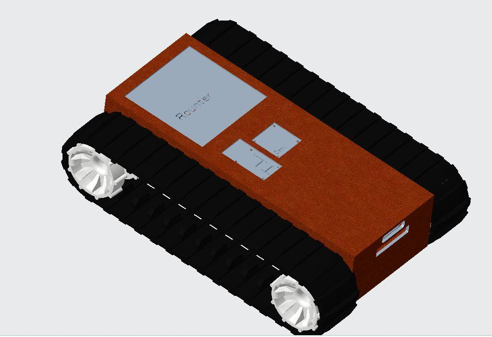

<H2>See how our design has evolved...</H2>

---
Initial Design
---

  
  
   

<TABLE>
   <TR>
    <TD><b>Name</b></TD>
     <TD><b>Desciption</b></TD>
     <TD><b>Length</b></TD> 
     <TD><b>Height</b></TD>
     <TD><b>Width</b></TD>
  </TR>
  <TR>
    <TD align="center">Design 1</TD>
    <TD align="center">Right View in CREO</TD>
    <TD align="center">11"</TD> 
    <TD align="center">10"</TD>
    <TD align="center">5"</TD>
  </TR>
  </TABLE>
  

  
<!--
|   Name  |  Description   | Cost | Weight|  Power  |
|:-------:|:--------------:|:----:|:-----:|:-------:|
|Spark Max|Motor Controller|166.39|0.5 lbs|2.4 watts|
