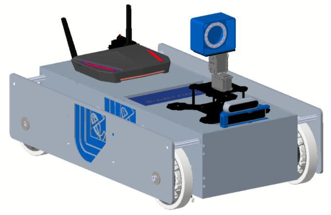
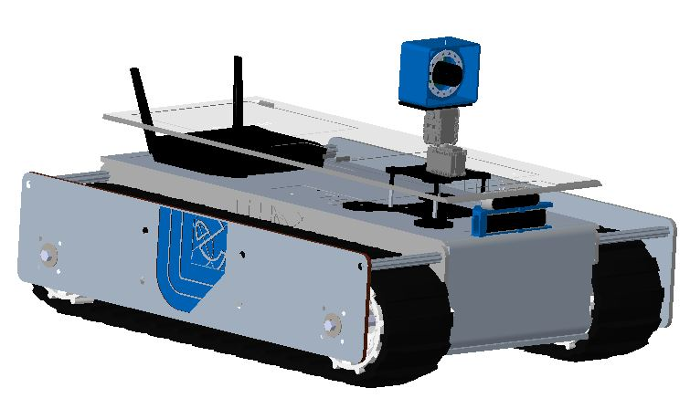
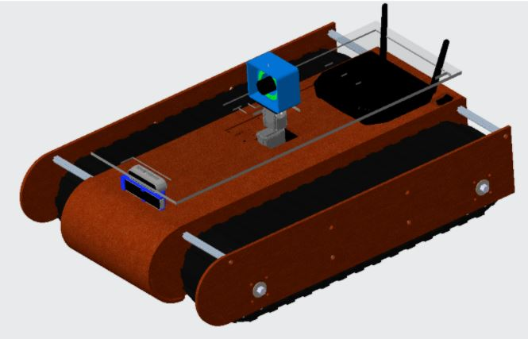
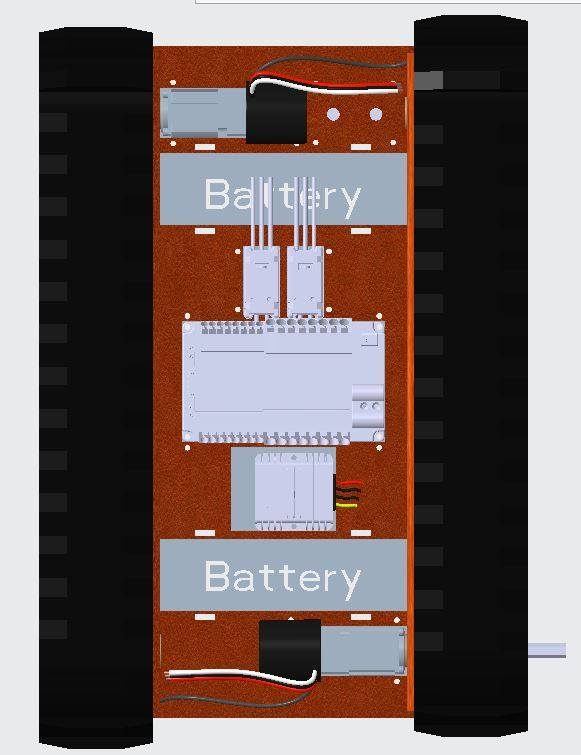

<H2>See how the design has evolved...</H2>

---
Design 3
---
Updated chassis due to battery changes and added wheels.

  

  

<TABLE>
   <TR>
    <TD><b>Name</b></TD>
     <TD><b>Description</b></TD>
     <TD><b>Length</b></TD> 
     <TD><b>Height</b></TD>
     <TD><b>Width</b></TD>
     <TD><b>Weight</b></TD>
  </TR>
  <TR>
    <TD align="center">Design 3.0 </TD>
    <TD align="center">Protoype</TD>
    <TD align="center"> 25.5"</TD> 
    <TD align="center">16.25"</TD>
    <TD align="center"> 6"</TD>
   <TD align="center"> 46 lbs </TD>
  </TR>
  </TABLE>

---
Design 2: First Prototype
---
The chassis size increased to fit all components. 

  

  
  

<TABLE>
   <TR>
    <TD><b>Name</b></TD>
     <TD><b>Description</b></TD>
     <TD><b>Length</b></TD> 
     <TD><b>Width</b></TD>
     <TD><b>Height</b></TD>
     <TD><b>Weight</b></TD>

  </TR>
  <TR>
    <TD align="center">Design 2</TD>
    <TD align="center">Protoype</TD>
    <TD align="center"> 28"</TD> 
    <TD align="center">20.5"</TD>
    <TD align="center">5.5"</TD>
    <TD align="center">32 lbs</TD>
  </TR>
  </TABLE>

## Design 1.1: First Prototype

Added camera mount, inspection camera, and wifi router.

  

  

<TABLE>
   <TR>
    <TD><b>Name</b></TD>
     <TD><b>Description</b></TD>
     <TD><b>Length</b></TD> 
     <TD><b>Height</b></TD>
     <TD><b>Width</b></TD>
  </TR>
  <TR>
    <TD align="center">Design 1.0</TD>
    <TD align="center">Protoype</TD>
    <TD align="center"> 24.63"</TD> 
    <TD align="center">9.75"</TD>
    <TD align="center">5.04"</TD>
  </TR>
  </TABLE>

  

## Initial Design 1.0

The dimensions of the initial design came from our first choice of premade chassis. 

  
  
   

                                                                            

<TABLE>
   <TR>
    <TD><b>Name</b></TD>
     <TD><b>Desciption</b></TD>
     <TD><b>Length</b></TD> 
     <TD><b>Height</b></TD>
     <TD><b>Width</b></TD>
  </TR>
  <TR>
    <TD align="center">Design 1</TD>
    <TD align="center">Initial model</TD>
    <TD align="center">12.5"</TD> 
    <TD align="center">11"</TD>
    <TD align="center">4"</TD>
  </TR>
  </TABLE>
  

