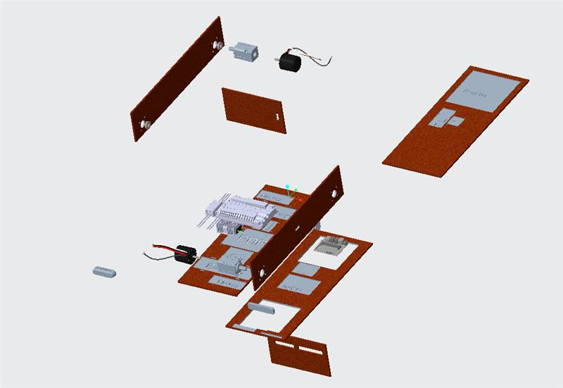

<H2>See how our design has evolved...</H2>

---
Initial Design
---
Models were sketched in CREO.

  
  
   

                                                                                          

<TABLE>
   <TR>
    <TD><b>Name</b></TD>
     <TD><b>Desciption</b></TD>
     <TD><b>Length</b></TD> 
     <TD><b>Height</b></TD>
     <TD><b>Width</b></TD>
  </TR>
  <TR>
    <TD align="center">Design 1</TD>
    <TD align="center">Initial model</TD>
    <TD align="center">11"</TD> 
    <TD align="center">10"</TD>
    <TD align="center">5"</TD>
  </TR>
  </TABLE>
  

  
