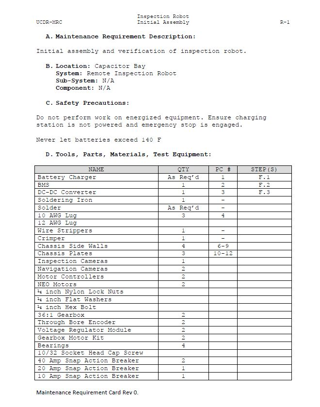

### Documents
   <!-- 
Documents List
 -->
#### Software
<ul>
<li><a href="https://mesmerizing-engineers.github.io/MESMerizing-Engineers/docs/components#DataLifeCycle">Data Life Cycle</a></li>
<li><a href="https://mesmerizing-engineers.github.io/MESMerizing-Engineers/docs/components#SoftwareStack">Software Stack</a></li>
</ul>

#### Safety Standards

<ul>
<li><a href="https://mesmerizing-engineers.github.io/MESMerizing-Engineers/docs/components#SafetyNote">Safety Note</a></li>
</ul>

#### Maintenance 

<ul>
<li><a href="https://mesmerizing-engineers.github.io/MESMerizing-Engineers/docs/components#Maintenance">Maintenance Checklist</a></li>
</ul>

## Data Life Cycle

  

<a href="Data_Life_Cycle__V2.pdf">Download Data Life Cycle Here</a>
  

  

## Software Stack
Sent to Cybersecurity for review.

  

## Safety Note
Safety Note is continuously being udpated.

## Maintenance Checklist

  
   Preview of maintenance checklist

<a href="UCDR_R1.pdf">Download Maintence Checklist Here</a>
  

