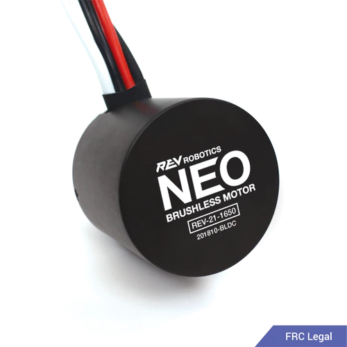

<!-- Changes made by Liam 12/5 -->

  
Components List

 <a href="https://mesmerizing-engineers.github.io/MESMerizing-Engineers/docs/test#MC">Motor Controller</a> 
 <a href="https://mesmerizing-engineers.github.io/MESMerizing-Engineers/docs/test#Brushless-Motor">Brushless Motor Controller</a> 
 <a href="https://mesmerizing-engineers.github.io/MESMerizing-Engineers/docs/test#Gearbox">Gearbox</a> 

  
Components List

  <ul>
    <li> Structural</li>
    <ul>
 <li><a href="https://mesmerizing-engineers.github.io/MESMerizing-Engineers/docs/test#MC">Motor Controller</a><li/>
 <a href="https://mesmerizing-engineers.github.io/MESMerizing-Engineers/docs/test#Brushless-Motor">Brushless Motor Controller</a>
 <li><a href="https://mesmerizing-engineers.github.io/MESMerizing-Engineers/docs/test#Gearbox">Gearbox</a></li>
    </ul>
    <li> Power </li>
  </ul>

  

|   Name  |  Description   | Cost | Weight|  Power  |
|:-------:|:--------------:|:----:|:-----:|:-------:|
|Spark Max|Motor Controller|166.39|0.5 lbs|2.4 watts|

  

|   Name  |  Description   | Cost | Weight|  Power  |
|:-------:|:--------------:|:----:|:-----:|:-------:|
|   NEO   |Brushless Motor |93.07 |1.9 lbs|Variable |

  

|   Name  |  Description   | Cost  | Weight|  Power  |
|:-------:|:--------------:|:-----:|:-----:|:-------:|
|CIM Sport|    Gear Box    |192.00 |3.14lbs|         |
