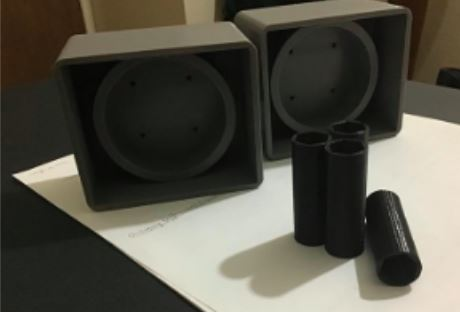

## Home Page Content
___
# Hawkeye
Follow our progress...

  

<H2> Autonomous Inspection Robot</H2>

  <ul>
    <li> Highlights</li>
    <ul>
    <!-- Add Milestones Here -->      
<li><a href="https://mesmerizing-engineers.github.io/MESMerizing-Engineers/index#Milestone">Project Milestone Schedule</a></li>
    </ul>
    <li> Spring Quarter Weekly Updates</li>
    <ul>
    <!-- Put Spring Quarter Updates Here -->      
<li><a href="https://mesmerizing-engineers.github.io/MESMerizing-Engineers/index#WQ8">Winter Quarter Week 8 Updates</a></li>
    </ul>
    <li> Winter Quarter 2020 Weekly Updates </li>
    <ul>
    <!-- Put Winter Quarter Updates Here -->
<li><a href="https://mesmerizing-engineers.github.io/MESMerizing-Engineers/index#WQ8">Winter Quarter Week 8 Updates</a></li>
<li><a href="https://mesmerizing-engineers.github.io/MESMerizing-Engineers/index#WQ7">Winter Quarter Week 7 Updates</a></li>
<li><a href="https://mesmerizing-engineers.github.io/MESMerizing-Engineers/index#WQ6">Winter Quarter Week 6 Updates</a></li>
<li><a href="https://mesmerizing-engineers.github.io/MESMerizing-Engineers/index#WQ5">Winter Quarter Week 5 Updates</a></li>
<li><a href="https://mesmerizing-engineers.github.io/MESMerizing-Engineers/index#WQ4">Winter Quarter Week 4 Updates</a></li>
<li><a href="https://mesmerizing-engineers.github.io/MESMerizing-Engineers/index#WQ3">Winter Quarter Week 3 Updates</a></li>
<li><a href="https://mesmerizing-engineers.github.io/MESMerizing-Engineers/index#WQ2">Winter Quarter Week 2 Updates</a></li>
<li><a href="https://mesmerizing-engineers.github.io/MESMerizing-Engineers/index#WQ1">Winter Quarter Week 1 Updates</a></li>
    </ul>
    <li> Fall Quarter 2020 Weekly Updates </li>
    <ul>
    <!-- Put Fall Quarter Updates Here -->
<li><a href="https://mesmerizing-engineers.github.io/MESMerizing-Engineers/index#FQ10">Fall Quarter Week 10 Updates</a></li>
    </ul>
  </ul>

Project Milestone Schedule

## Project Milestone Schedule
- FMEA Review - 11/9/2020
- Data Cycle Review - 11/16/2020
- Safety Note Review - In Progress
- Conceptual Design Review - TBD

We got a wheel moving!

  
## We got a wheel moving! 8 MAR 2021

<iframe width="560" height="315" src="https://www.youtube.com/embed/VcM2S-kSjew" frameborder="0" allow="accelerometer; autoplay; clipboard-write; encrypted-media; gyroscope; picture-in-picture" allowfullscreen></iframe>

 PWM is now working smoothly

  
## PWM is now working smoothly - Alex | Nick 7 MAR 2021

<iframe width="560" height="315" src="https://www.youtube.com/embed/qoUVXheuOjs" frameborder="0" allow="accelerometer; autoplay; clipboard-write; encrypted-media; gyroscope; picture-in-picture" allowfullscreen></iframe>

- Alex updated the arduino code for changing resolution.
- Nick tested full forward and full reverse with the new code and implemented interrupt
pins which resulted smooth transitions.

 Remote Control Functionality Test 

  
## Remote Control Functionality Test - Alex Yu 1 MAR 2021

<iframe width="560" height="315" src="https://www.youtube.com/embed/hM1WgEU2hRA" frameborder="0" allow="accelerometer; autoplay; clipboard-write; encrypted-media; gyroscope; picture-in-picture" allowfullscreen></iframe>

 LCD Display for strain gauge readings 

  
## LCD Display for strain gauge readings - Liam Moore 26 FEB 2021
To comply with ANSI safety standards, this will help monitor the status of the battery.
and will be mounted on the side of the robot
LCD can cycle between different screens
- Display 
  - strain readings
  - battery percentage
  - time of operation
  - operation status
  - faults
  - storage

  

 Winter Quarter Week 9 Updates

  
## Winter Quarter Week 9 Updates - 5 Mar 2021

Software
  - Verified hardware client for PWM

Documentation
For compliance with safety standards, the following was received this week
- IPC/WHMA-A-620C-ENGLISH: Requirements and Acceptance for Cable and Wire Harness Assemblies
- Github updates added

Mechanical
- Ordered wheels and wheel assembly parts
- CREO updated with new battery and wheels
- Charging station updates for LiFEPO4 battery

Electrical
- Proposed options following DC-DC converter failure

  
  

  

 Winter Quarter Week 8 Updates - 26 Feb 2021 

## Winter Quarter Week 8 Updates - 26 Feb 2021

Software
  - ROS script written for motor testing
  -  Camera mount remote control
  - Considering TI Launch pad for PWM implementation
Electrical
- LCD Display for strain gauge circuit added
- Electrical bench test performed
  - DCDC converter malfunction
Hardware
 - Emergency stop button added
Mechanical:
- Additions for chassis

   
  Figure 1: Interconnections between major components.  
   
  Figure 2: Bottom-level board layout.  
  
  Figure 3: Assembled Prototype-1 Baseplate. 

 Week 7 - 19 Feb 2021 

  
## Winter Quarter Week 7 Updates - 19 Feb 2021

Ordered more components:
  - ADALM-2000 for benchmark testing
  - Thermal image sensor
 
Mechanical updates and concerns that have come up:

   
  Figure 1: Additional support to be added due to battery weight.  
   
  Figure 2: Mid level board with battery inspection window.  
  
  Figure 1: Assembled Prototype-1 Baseplate. 

## Winter Quarter Week 6 Updates - 12 Feb 2021
Exciting week!

Mechanical
  - Wire assembly and connections between components begun this week
      
  CREO
  - Modifications done in CREO

  
  
  
   
  Figure 1: Component Assembly preparation. 
  

## Winter Quarter Week 5 Updates - 5 Feb 2021

Mechanical
  - Lasercut second iteration of panels
    - UC Davis Logo added to side panels

   
  Figure 1: Prototype second iteration  
  
   
  Figure 2: Bottom panel. 
   
   
  Figure 3: Front and back panels. 
  
   
  Figure 4: Side panels with UC Davis logo added. 
  
  
  Figure 5: Modified design in CREO. 

## Winter Quarter Week 4 Updates - 29 Jan 2021

Documentation

  - Main focus this week was preparing for the Concept Design Review presentation
      -  Failure Mode Effect Analysis (FMEA)

  
  Figure: Partial View of FMEA. This highlights five causes of failures that can occur.

  
Mechanical
  - Updates in CREO -- new color scheme! 
  

   
  

Hardware
  -   Prototype assembled

   

## Winter Quarter Week 3 Updates - 22 Jan 2021

   
   
   

Software
  1. Jetson/ROS
    Compatibility issues:
      - RTABMap performance is slow
      - 3-d point cloud is blank
      - Problems with Realsense SDK installation 
    Continued Troubleshooting:
      - Parameter tuning 
      - Software reinstallation

2. Raspberry Pi 4:
    ROS installed 
      - Server→ Ubuntu 18.04 Desktop
      - Melodic
          Python3 
3. Machine Learning Course
    - Started courses to implement image processing 

Hardware

  -   Laser cut panels for prototype
 

## Redesigned component configuration - Uyen, Nick, Liam 19 FEB 2021

  

Update from previous week, the components were rearranged.

## Winter Quarter Week 2 Updates - 15 Jan 2021

  

Mechanical
  - Chassis materials purchased
    - Fiberboard
    - Washers
    - Stainless Steel Hex bolts
    - Corner braces   
  - Lab Schedule set to begin prototype production
 
Hardware
  -   Inspection camera case was reprinted

Software
  Navigation cameras
  - ROS installed and operate on the same LAN
  - Bi-directional ssh enabled on both devices 
  - Found reflections from depth images

 Electrical
  - Strain gauge implementation for batteries 

  

## Winter Quarter Week 1 Updates - 8 Jan 2021

   
  

Hardware
  - Received second myRIO

3D printed
  -   Intel RealSense camera mount
  -   Drive wheel adapters
  -   Inspection camera case 
  -   Fleur camera case

Documentation
  The following documents were being prepared for the Concept Design Review Presentation
  - Safety Note
    - Based on Designing and Fabricating Safe Electrical Equipment
    - IPC/WHMA-A-620C  
  - Software Stack

CREO
  Design was updated to add the following
  - Wifi router
  - Navigation cameras
  - Inspection camera and mount
  - Side guards for track protection

D435i Mapping + Tracking Progress
<iframe width="560" height="315" src="https://www.youtube.com/embed/NDkw-YhQfXI" frameborder="0" allow="accelerometer; autoplay; clipboard-write; encrypted-media; gyroscope; picture-in-picture" allowfullscreen></iframe>

## Turret is ready to be added on to the chassis - Jen Dacanay 3 JAN 2021

  

Verified the turret was configured corrrectly
Video shows the turret running the PXTurretTest

<iframe width="560" height="315" src="https://www.youtube.com/embed/jeZ6y1lZpQQ" frameborder="0" allow="accelerometer; autoplay; clipboard-write; encrypted-media; gyroscope; picture-in-picture" allowfullscreen></iframe>

## We have Mapping! - Alex Yu 24 DEC 2020
With the holidays just around the corner, we are all enjoying some much needed R&R. That said, it's never a bad time to post an update!

  

The team started the ROS tutorials just before end of the quarter. Combined with the arrival of the Intel Realsense cameras, I begun work on implementing a SLAM Algorithm. RTABMap has a ready-to-go ROS package that works with just the single D435i depth camera to get us started. Running the RTABMap, we feed the combined depth and color image as well as the camera's oboard imu sensor information. The figure above is a 2-d snapshot of the occupancy map that was generated when I briefly walked around my home. The black areas are believed to be occupied will the white area is open.  
 For a first time run, I call this a win!. We can definitely see some issues with this though. For example, the black spotting in the living room seems to be an issue. I suspect this is due to the height that I was holding the camera at when walking around the living room.     
Alot more testing is required, but this has been quite the learning experience! 
Happy Holidays! - Alex Yu

<H2>HawkEye</H2>

  

<H2>Chassis Blowup View</H2>

  

<H2>Top View</H2>

  

